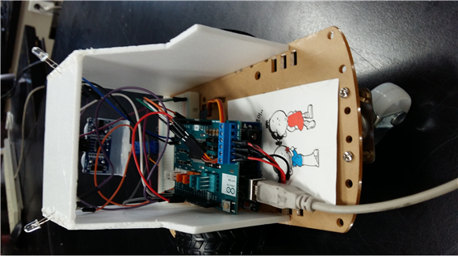
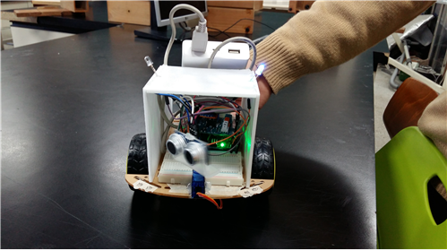

## 로봇 코딩

```c++
#include <Servo.h> 
 서보 라이브러리를 사용하기 위해 
int servoPin = 10;
서보 모터 핀을 10번으로 잡는다.
Servo servo;
servo의 변수를 지정해준 것이다.
int angle = 90; // servo position in degrees
각도를 90도로 지정 해둔 것이다. 
int trigPinTop = 5;
초음파 센서의 트리거핀을 5번에 꼽는다.
int echoPinTop = 4;
초음파 센서의 에코핀을 4번에 꼽는다.
int a = 12;
오른쪽 모터의 속도 조절
int b = 3;
오른쪽 모터의 방향 조절
int c = 13;
왼쪽 모터의 속도 조절
int d = 11;
왼쪽 모터의 방향조절
int led = 7;
빨간색 led를 7번 핀에 꼽는다.
int blue = 6;
파란색 led를 6번 핀에 꼽는다.

void setup() { 
   servo.attach(servoPin); 
	서보 변수에게 실제로 어떤 핀을 사용할지 알려 주는 것이다.
   Serial.begin(9600);
 시리얼 모니터를 시작한다.
   pinMode(trigPinTop, OUTPUT);
트리거 핀쪽을 출력한다.
   pinMode(echoPinTop, INPUT);
에코 핀쪽을 받아들인다.
   pinMode(a,OUTPUT);
오른쪽 모터의 속도를 출력한다.
   pinMode(b,OUTPUT);
오른쪽 모의방 방향을 출력한다.

   pinMode(c,OUTPUT);
왼쪽 모터의 속도를 출력한다.
   pinMode(d,OUTPUT);
왼쪽 모터의 방향을 출력한다.
   pinMode(led, OUTPUT);
빨간색 led를 출력한다.
   pinMode(blue, OUTPUT);
파란색 led를 출력한다.
} 

void loop() { 
  // scan from 0 to 180 degrees
   angle = 90;
서보 모터를 90도 방향으로 회전 시킨다.
    servo.write(angle); 
    delay(50); 
    movingR();
 
  
   angle = 180;
서보모터를 180도 방향으로 회전 시킨다.
   servo.write(angle); 
     delay(50); 
   movingR();

      angle = 90;
    servo.write(angle); 
    delay(50); 
    movingR();
    

   angle = 30;
서보모터를 30도 방향으로 회전 시킨다.
   servo.write(angle); 
       delay(50); 
     movingR();

       angle = 90;
    servo.write(angle); 
    delay(50); 
    movingR();
 
 
  

} 


void movingR () {
               float durationTop;
              float distanceTop;
거리와 시간을 정수로 저장한다.
                
   //초음파를 보낸다. 다 보내면 echo가 HIGH 상태로 대기하게 된다.

   digitalWrite(trigPinTop, HIGH);
   delay(10);
  
   digitalWrite(trigPinTop, LOW);
   //echoPin이 HIGH를 유지한 시간을 저장 한다.
 
   durationTop = pulseIn(echoPinTop, HIGH);
   //HIGH였을 때 시간(초음파가 보냈다가 다시 들어온 시간)을 가지고 거리를 계산한다.
  
   distanceTop = ((float)(340*durationTop)/10000)/2;
   Serial.print(distanceTop);
   Serial.println(";Top");
   //수정한 값을 출력 
   if(distanceTop>20) {
    bluelight ();
    moving1();
   }
   else if(distanceTop<20){
   redlight ();
   stoping ();
   back ();
   righting ();
   }
}


void moving1 (){analogWrite(b,220);
    digitalWrite(a,LOW);
    analogWrite(d,220);
    digitalWrite(c,LOW);
    delay(100);}
 -> 220의 속도로 전진을 시키는 함수를 만든 것이다.
void stoping (){
     analogWrite(b,0);
    digitalWrite(a,HIGH);
    analogWrite(d,0);
    digitalWrite(c,HIGH);
    delay(300);}
 -> 모터를 정지 시키는 함수를 만든 것이다.

void back (){
  analogWrite(b,220);
    digitalWrite(a,HIGH);
   analogWrite(d,220);
    digitalWrite(c,HIGH);
    delay(300);}
 -> 220의 속도로 후진 시키는 함수를 만든 것이다.

void righting (){
  analogWrite(b,250);
    digitalWrite(a,HIGH);
   analogWrite(d,250);
    digitalWrite(c,LOW);
    delay(50);}
 ->오른쪽으로 회전을 하도록 함수를 만든 것이다.

    void lefting (){
      analogWrite(b,230);
    digitalWrite(a,LOW);
   analogWrite(d,230);
    digitalWrite(c,HIGH);
    delay(50);}
-> 왼쪽으로 회전을 하도록 함수를 만든 것이다.


 void redlight (){
  digitalWrite(6,LOW);
  delay(50);
  digitalWrite(7,HIGH);
  delay(50);
 }
빨간 led가 켜지도록 만든 것이다.

void bluelight (){
  digitalWrite(7,LOW);
  delay(50);
  digitalWrite(6,HIGH);
  delay(50);
 }
파란 led가 켜지도록 만든 것이다.
```

